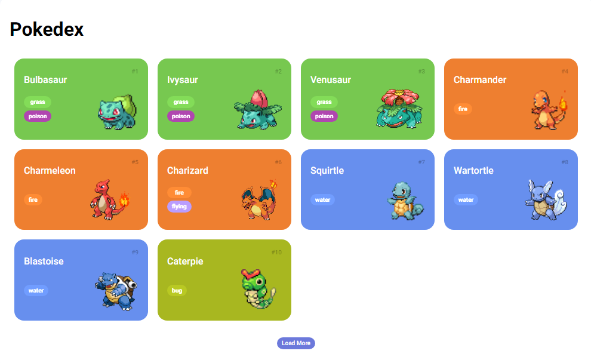

# Pokedex - Desafio da Plataforma DIO

A Pokedex é uma aplicação web desenvolvida como parte de um desafio proposto pela plataforma DIO (Digital Innovation One). O objetivo do desafio é consumir a API do PokeAPI para listar os Pokémon e suas informações em um formato de lista. Neste documento, vamos abordar como a Pokedex foi implementada, quais tecnologias foram utilizadas e como ela funciona.

## Funcionalidades
A Pokedex desenvolvida neste desafio possui as seguintes funcionalidades:

- Listagem de Pokémon: A aplicação consome a API do PokeAPI para carregar uma lista de Pokémon. Cada Pokémon exibido na lista contém seu número, nome, tipos e uma imagem representativa.
- Paginação: A lista de Pokémon é carregada em blocos de 10 itens por vez. O usuário pode clicar no botão "Load More" para carregar mais Pokémon na lista.

## Tecnologias Utilizadas
A Pokedex foi desenvolvida utilizando as seguintes tecnologias:

- HTML: Estrutura da página web.
- CSS: Estilização dos elementos da página.
- JavaScript: Lógica de programação para consumir a API e interagir com o usuário.
- PokeAPI: API pública que fornece dados sobre os Pokémon.
- Normalize.css: Biblioteca para garantir estilos consistentes em diferentes navegadores.

## Estrutura do Código
A Pokedex é composta por três arquivos principais:

1. index.html: Este arquivo contém a estrutura da página HTML, incluindo os elementos para exibir a lista de Pokémon e o botão de carregamento.

2. main.js: Neste arquivo, a lógica principal da aplicação é implementada. Ele consome a API do PokeAPI, carrega a lista de Pokémon, implementa a funcionalidade de paginação e permite a exibição dos detalhes dos Pokémon.

3. poke-api.js: Este arquivo contém as funções relacionadas à API do PokeAPI. Ele faz solicitações à API para obter informações detalhadas dos Pokémon.

## Como Funciona
Ao abrir a página, a Pokedex carrega uma lista inicial de 10 Pokémon. O usuário pode clicar no botão "Load More" para carregar mais Pokémon na lista. Cada Pokémon é exibido como um card com seu número, nome, tipos e uma imagem.

## Conclusão
A Pokedex desenvolvida como parte do desafio da plataforma DIO demonstra como consumir uma API pública para exibir informações em uma página web. Utilizando HTML, CSS e JavaScript, a aplicação proporciona uma experiência interativa ao usuário, permitindo explorar os detalhes de diferentes Pokémon. Com funcionalidades como a listagem paginada e a exibição de detalhes, a Pokedex representa um exemplo prático de consumo de API e criação de uma interface de usuário simples e funcional.